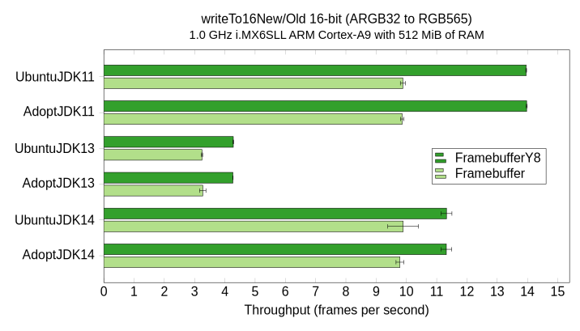
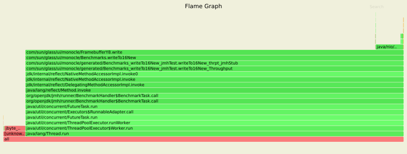
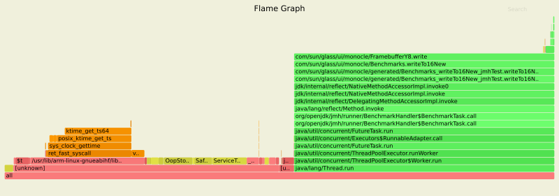
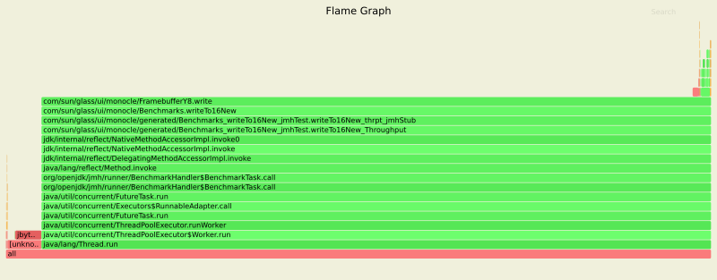

# May 2020
{:.no_toc}

* Generates table of contents as an unordered list
{:toc}

## JDK 13 Performance

The chart below shows the problem that caught my attention in December 2019:

{:width="727" height="410"}

The performance has since been restored in the latest release of JDK 14, as seen in the chart below from May 2020, but I still wanted to figure out what caused the drop in performance and why it remains in JDK 13.

{:width="716" height="410"}

The [async-profiler](https://github.com/jvm-profiling-tools/async-profiler) tool helped me identify the source of the problem.
I ran the profiler for 30 seconds during iterations of the `writeTo16New` benchmark test on an ARM Cortex-A9 device.
The three [flame graphs](https://github.com/BrendanGregg/FlameGraph) below clearly show the difference between the faster JDK versions 11 and 14 and the slower JDK 13.
The bars in the graphs are colored as follows:

| Color  | Code |
|--------|------|
| Green  | Java source code |
| Yellow | C++ source code |
| Red    | Native code in user space |
| Orange | Native code in kernel space |

### Ubuntu JDK 11

See also the [interactive flame graph](java-11-openjdk-armhf.svg) in SVG format.

{:width="800" height="303"}

With JDK 11, almost all of the CPU usage is dedicated to the Java benchmark test:

```console
$ top -H -b -n 3 | grep -A5 'PID USER'
...
  PID USER      PR  NI    VIRT    RES    SHR S  %CPU  %MEM     TIME+ COMMAND
30084 ubuntu    20   0  204132  35824  10716 R  98.0   7.0   0:24.08 com.sun.glass.u
...
```

### Ubuntu JDK 13

See also the [interactive flame graph](java-13-openjdk-armhf.svg) in SVG format.

{:width="800" height="281"}

With JDK 13, the Java benchmark test is being crowded out by two threads labeled `Service Thread` and is able to get only about a third of the CPU usage:

```console
$ top -H -b -n 3 | grep -A5 'PID USER'
...
  PID USER      PR  NI    VIRT    RES    SHR S  %CPU  %MEM     TIME+ COMMAND
30113 ubuntu    20   0  199984  27488  10804 R  32.8   5.4   0:15.33 Service Thread
30130 ubuntu    20   0  204484  36508  10912 R  32.8   7.2   0:12.81 Service Thread
30136 ubuntu    20   0  204484  36508  10912 R  32.8   7.2   0:10.12 com.sun.glass.u
...
```

Searching for the two C++ classes in the flame graph, `OopStorage` and `ServiceThread`, lead me to the first bug in the list below, which then lead to the second related bug.

1. [JDK-8226366](https://bugs.openjdk.java.net/browse/JDK-8226366): Excessive ServiceThread wakeups for OopStorage cleanup
2. [JDK-8231612](https://bugs.openjdk.java.net/browse/JDK-8231612): 100% cpu on arm32 in Service Thread

I think it's very likely that I'm seeing the second bug in my tests.
Fortunately, the bug was [fixed for JDK 15](https://github.com/openjdk/jdk/commit/4d1176fd608497c8946cb986c8008a638c0c2c55) by Aleksei Voitylov on December 13, 2019, and [back-ported to JDK 14](https://github.com/openjdk/jdk/commit/f58a8cbed2ba984ceeb9a1ea59f917e3f9530f1e) on December 18, 2019.

Thank you, Aleksei!

### Ubuntu JDK 14

See also the [interactive flame graph](java-14-openjdk-armhf.svg) in SVG format.

{:width="800" height="313"}

With JDK 14, as with JDK 11, almost all of the CPU usage is once again dedicated to the Java benchmark test:

```console
$ top -H -b -n 3 | grep -A5 'PID USER'
...
  PID USER      PR  NI    VIRT    RES    SHR S  %CPU  %MEM     TIME+ COMMAND
30191 ubuntu    20   0  209256  38624  12412 R  98.0   7.6   0:30.30 com.sun.glass.u
...
```

## VM Comparisons

### ARM Cortex-A9

#### Ubuntu 20.04

##### copyTo16New/Old


##### writeTo16New/Old


##### copyTo32New/Old


##### writeTo32New/Old


### Intel Xeon Processor

#### Ubuntu 20.04

##### copyTo16New/Old


##### writeTo16New/Old


##### copyTo32New/Old


##### writeTo32New/Old


## Benchmarks

The results of the benchmark tests are grouped by the processor, operating system, and build of the Java Development Kit (JDK) on which they ran.

I ran the following command for the benchmark tests:

```console
$ java -jar target/benchmarks.jar -p type=large
```

### ARM Cortex-A9

#### Ubuntu 20.04

##### Ubuntu OpenJDK 11


##### AdoptOpenJDK 11


##### Ubuntu OpenJDK 13


##### AdoptOpenJDK 13


##### Ubuntu OpenJDK 14


##### AdoptOpenJDK 14


### QEMU ARM VM

#### Ubuntu 20.04

##### Ubuntu OpenJDK 11


##### AdoptOpenJDK 11


##### Ubuntu OpenJDK 13


##### AdoptOpenJDK 13


##### Ubuntu OpenJDK 14


##### AdoptOpenJDK 14


### Intel Xeon Processor

#### Ubuntu 20.04

##### Ubuntu OpenJDK 11


##### AdoptOpenJDK 11


##### Ubuntu OpenJDK 13


##### AdoptOpenJDK 13


##### Ubuntu OpenJDK 14


##### AdoptOpenJDK 14

