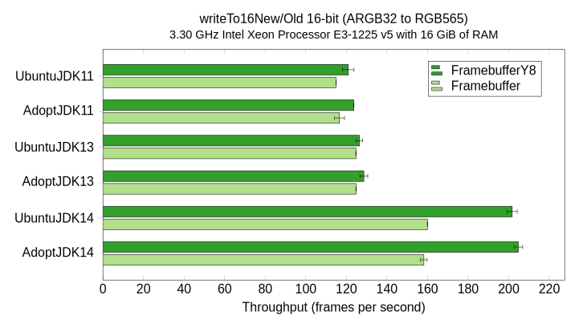

# Benchmarks

This is the website of the [JavaFX FramebufferY8 Benchmarks](https://github.com/jgneff/framebufferY8) repository.
This site documents the results of the benchmark tests comparing the new `FramebufferY8` class with the old `Framebuffer` class.
These classes are part of the Monocle implementation of the Glass windowing component in the JavaFX Graphics module.

The purpose of the benchmarks is to show that we can replace the methods in the `Framebuffer` superclass with those of its `FramebufferY8` subclass and eliminate the subclass entirely.
The results of the benchmarks also show a performance problem in JDK 13 on ARM processors, which is described below.

I have done three rounds of tests, denoted by the month they were started: [2020-05](2020-05/), [2020-04](2020-04/), and [2019-12](2019-12/).

## 2020-05

The results of my third round of tests in May 2020 are published on the [2020-05](2020-05/) page.

This round of tests confirmed what I saw in April: JDK 13 on ARM processors had a remarkable drop in performance that has [mostly returned](2020-05/#writeto16newold) in the latest release of JDK 14.

{:width="716" height="410"}

| Name        | VM Version |
|-------------|------------|
| UbuntuJDK11 | JDK 11.0.7, OpenJDK Server VM, 11.0.7+10-post-Ubuntu-3ubuntu1 |
| AdoptJDK11  | JDK 11.0.7, OpenJDK Server VM, 11.0.7+10 |
| UbuntuJDK13 | JDK 13.0.3, OpenJDK Server VM, 13.0.3+3-Ubuntu-1ubuntu2 |
| AdoptJDK13  | JDK 13.0.2, OpenJDK Server VM, 13.0.2+8 |
| UbuntuJDK14 | JDK 14.0.1, OpenJDK Server VM, 14.0.1+7-Ubuntu-1ubuntu1 |
| AdoptJDK14  | JDK 14.0.1, OpenJDK Server VM, 14.0.1+7 |

For comparison, the chart below shows the performance of the [same method on an Intel Xeon processor](2020-05/#writeto16newold-1).

{:width="716" height="410"}

| Name        | VM Version |
|-------------|------------|
| UbuntuJDK11 | JDK 11.0.7, OpenJDK 64-Bit Server VM, 11.0.7+10-post-Ubuntu-3ubuntu1 |
| AdoptJDK11  | JDK 11.0.7, OpenJDK 64-Bit Server VM, 11.0.7+10 |
| UbuntuJDK13 | JDK 13.0.3, OpenJDK 64-Bit Server VM, 13.0.3+3-Ubuntu-1ubuntu2 |
| AdoptJDK13  | JDK 13.0.2, OpenJDK 64-Bit Server VM, 13.0.2+8 |
| UbuntuJDK14 | JDK 14.0.1, OpenJDK 64-Bit Server VM, 14.0.1+7-Ubuntu-1ubuntu1 |
| AdoptJDK14  | JDK 14.0.1, OpenJDK 64-Bit Server VM, 14.0.1+7 |

The flame graph below helped me [figure out the cause](2020-05/#jdk-13-performance) of the performance drop on ARM.

{:width="800" height="281"}

## 2020-04

The results of my second round of tests in April 2020 are published on the [2020-04](2020-04/) page.

The most interesting result was [the apparent fix](2020-04/#writeto16newold) in JDK 14.0.1 for the performance problem I saw in December, shown by the following graph of Ubuntu 20.04 on a 32-bit QEMU ARM virtual machine.

{:width="713" height="412"}

| Name        | VM Version |
|-------------|------------|
| AdoptJDK11  | JDK 11.0.7, OpenJDK Server VM, 11.0.7+10 |
| AdoptJDK12  | JDK 12.0.2, OpenJDK Server VM, 12.0.2+10 |
| AdoptJDK13  | JDK 13.0.2, OpenJDK Server VM, 13.0.2+8 |
| AdoptJDK14  | JDK 14.0.1, OpenJDK Server VM, 14.0.1+7 |

For comparison, the chart below shows the performance of the [same method on an Intel Xeon processor](2020-04/#writeto16newold-1).

{:width="717" height="410"}

| Name        | VM Version |
|-------------|------------|
| UbuntuJDK11 | JDK 11.0.7, OpenJDK 64-Bit Server VM, 11.0.7+10-post-Ubuntu-3ubuntu1 |
| AdoptJDK11  | JDK 11.0.7, OpenJDK 64-Bit Server VM, 11.0.7+10 |
| AdoptJDK12  | JDK 12.0.2, OpenJDK 64-Bit Server VM, 12.0.2+10 |
| AdoptJDK13  | JDK 13.0.2, OpenJDK 64-Bit Server VM, 13.0.2+8 |
| AdoptJDK14  | JDK 14.0.1, OpenJDK 64-Bit Server VM, 14.0.1+7 |
| OracleJDK14 | JDK 14.0.1, OpenJDK 64-Bit Server VM, 14.0.1+7 |

## 2019-12

The results of my first round of tests in December 2019 are published on the [2019-12](2019-12/) page.

The most interesting result was the [drop in performance](2019-12/#copyto16newold) on ARM processors starting in JDK 13, shown by the following graph of Ubuntu 20.04 on a 32-bit ARM Cortex-A9 processor.

{:width="727" height="410"}

| Name        | VM Version |
|-------------|------------|
| UbuntuJDK11 | JDK 11.0.5, OpenJDK Server VM, 11.0.5+10-post-Ubuntu-2ubuntu1 |
| AdoptJDK11  | JDK 11.0.5, OpenJDK Server VM, 11.0.5+10 |
| AdoptJDK12  | JDK 12.0.2, OpenJDK Server VM, 12.0.2+10 |
| UbuntuJDK13 | JDK 13.0.1, OpenJDK Server VM, 13.0.1+9-Ubuntu-2 |
| AdoptJDK13  | JDK 13.0.1, OpenJDK Server VM, 13.0.1+9 |
| UbuntuJDK14 | JDK 14-ea, OpenJDK Server VM, 14-ea+19-Ubuntu-1 |
