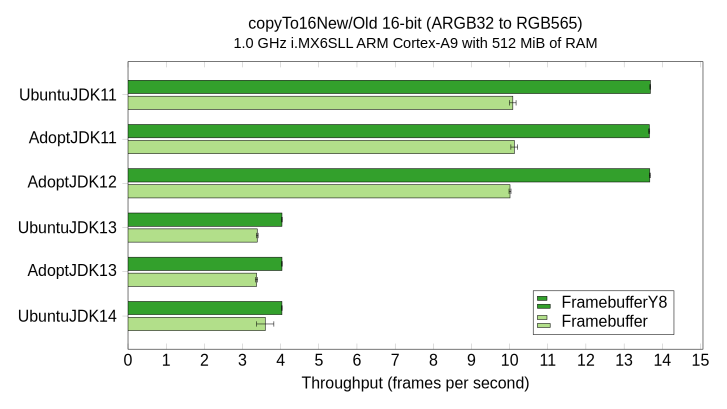

# Benchmarks

This is the website for the [JavaFX FramebufferY8 Benchmarks](https://github.com/jgneff/framebufferY8) repository.
This site documents the results of the benchmark tests comparing the new `FramebufferY8` class with the old `Framebuffer` class.
These classes are part of the Monocle implementation of the Glass windowing component in the JavaFX Graphics module.

## 2019-12

The results of my first round of tests in December 2019 are published on the [2019-12](2019-12/) page.

The most interesting result was the [drop in performance](2019-12/#copyto16newold) on ARM processors starting in JDK 13, shown by the following graph of Ubuntu 20.04 on a 32-bit ARM Cortex-A9 processor.

{:width="727" height="410"}

| Name        | VM Version |
|-------------|------------|
| UbuntuJDK11 | JDK 11.0.5, OpenJDK Server VM, 11.0.5+10-post-Ubuntu-2ubuntu1 |
| AdoptJDK11  | JDK 11.0.5, OpenJDK Server VM, 11.0.5+10 |
| AdoptJDK12  | JDK 12.0.2, OpenJDK Server VM, 12.0.2+10 |
| UbuntuJDK13 | JDK 13.0.1, OpenJDK Server VM, 13.0.1+9-Ubuntu-2 |
| AdoptJDK13  | JDK 13.0.1, OpenJDK Server VM, 13.0.1+9 |
| UbuntuJDK14 | JDK 14-ea, OpenJDK Server VM, 14-ea+19-Ubuntu-1 |

## 2020-04

The results of my second round of tests in April 2020 are published on the [2020-04](2020-04/) page.

The most interesting result was the [apparent fix in JDK 14.0.1](2020-04/#writeto16newold) for the performance problem seen last time, shown by the following graph of Ubuntu 20.04 on a 32-bit QEMU ARM virtual machine.

{:width="713" height="412"}

| Name        | VM Version |
|-------------|------------|
| AdoptJDK11  | JDK 11.0.7, OpenJDK Server VM, 11.0.7+10 |
| AdoptJDK12  | JDK 12.0.2, OpenJDK Server VM, 12.0.2+10 |
| AdoptJDK13  | JDK 13.0.2, OpenJDK Server VM, 13.0.2+8 |
| AdoptJDK14  | JDK 14.0.1, OpenJDK Server VM, 14.0.1+7 |

For comparison, the chart below shows the performance of the [same method on an Intel Xeon processor](2020-04/#writeto16newold-1).

{:width="717" height="410"}

| Name        | VM Version |
|-------------|------------|
| UbuntuJDK11 | JDK 11.0.7, OpenJDK 64-Bit Server VM, 11.0.7+10-post-Ubuntu-3ubuntu1 |
| AdoptJDK11  | JDK 11.0.7, OpenJDK 64-Bit Server VM, 11.0.7+10 |
| AdoptJDK12  | JDK 12.0.2, OpenJDK 64-Bit Server VM, 12.0.2+10 |
| AdoptJDK13  | JDK 13.0.2, OpenJDK 64-Bit Server VM, 13.0.2+8 |
| AdoptJDK14  | JDK 14.0.1, OpenJDK 64-Bit Server VM, 14.0.1+7 |
| OracleJDK14 | JDK 14.0.1, OpenJDK 64-Bit Server VM, 14.0.1+7 |
